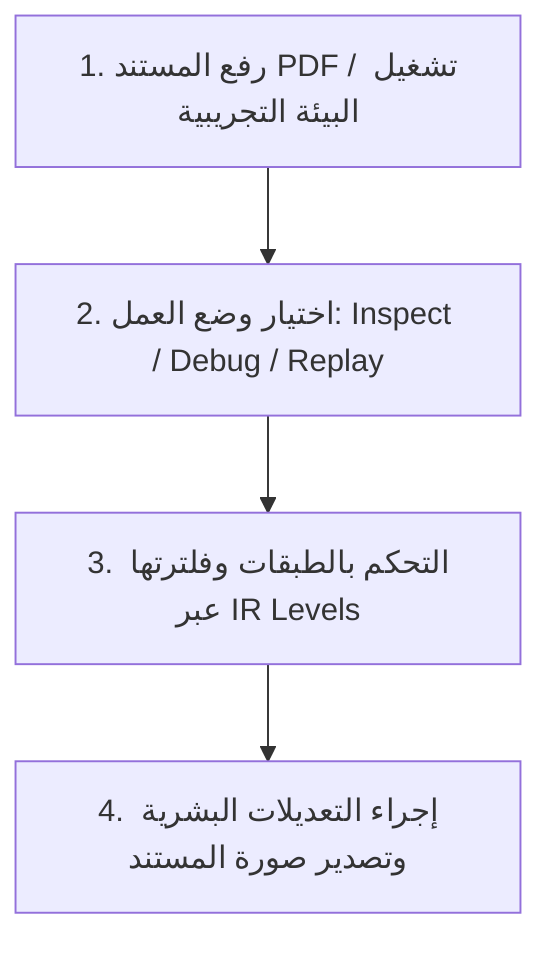

# 🧬 Evidence Workbench: دليل التشغيل والتصميم الفني

مرحباً بك في دليل تشغيل **Evidence Workbench**، وهو نظام تشغيل بصري (Spatial IDE) متطور مصمم خصيصاً لتدقيق وتصحيح عمليات محركات الاستدلال المكاني للوثائق الطبية والامتثال القانوني.

---

## 🎯 لماذا تم بناء Evidence Workbench؟ (Why)

تعاني أنظمة القراءة التقليدية للوثائق (Document Processing Pipelines) من مشكلة تسمى **"فقدان السياق المكاني" (Spatial Context Loss)**. عندما يقرأ نموذج الذكاء الاصطناعي وثيقة، فإنه يحولها إلى نصوص خطية متتالية، مما يؤدي إلى:
1. **فشل استيعاب الجداول (Table Topology):** تفقد الكلمات سياقها الشبكي (الأعمدة والصفوف).
2. **انعكاس النصوص ثنائية الاتجاه (Bi-directional Text):** مثل تداخل الكلمات العربية والإنجليزية وعكس ترتيب الأحرف.
3. **انحراف الإحداثيات (Coordinate Drift):** عدم تطابق الصناديق المحيطة (Bounding Boxes) بين محرك الـ OCR وبقية محركات الرؤية الحاسوبية.
4. **صعوبة التدقيق البشري:** عدم وجود إمكانية للـ **Human-In-The-Loop (HITL)** لمشاهدة وتعديل كيفية اتخاذ محرك الاستنباط لقراره.

لذلك، تم بناء **Evidence Workbench** ليكون بمثابة **بيئة تطوير هندسية (Engineering Console/IDE)** تدمج الرؤية الحاسوبية (Computer Vision)، الـ OCR، والنماذج اللغوية الكبيرة (LLMs) في واجهة موحدة تتيح للشباب والمراجعين إمكانية مراجعة وتصحيح وتكرار (Replay) عمليات الفحص بدقة كاملة وبشكل يقبل الفحص الجنائي للامتثال (Audit-Safe).

---

## 🚀 طريقة الاستخدام الأساسية (How to Use)

تتبع عملية التشغيل دورة حياة واضحة مقسمة إلى أربع خطوات رئيسية:

### 1. إدخال البيانات (Data Input)
* **رفع ملف PDF جديد (Upload PDF):** يرسل الملف إلى محرك المعالجة الخلفي لإنشاء المخططات والشبكات الهندسية ومطابقتها.
* **تشغيل البيئة التجريبية (Demo Fixture):** تتيح للمهندسين والمطورين اختبار كامل الواجهة باستخدام ملفات اختبارية مدمجة مسبقاً دون الحاجة لرفع مستندات فعلية.

### 2. التنقل البصري والتكبير (Navigation & Zoom)
* **التكبير والتصغير (Zoom):** استخدم عجلة الماوس أو أزرار `+` و `-` في لوحة المفاتيح لتكبير التفاصيل الهندسية المعقدة.
* **السحب والتحريك (Pan):** انقر مع السحب على أي منطقة فارغة لتحريك المستند بسلاسة.
* **إعادة التعيين (Reset):** اضغط على مفتاح `0` لإعادة تكبير المستند ليتناسب مع أبعاد الشاشة الافتراضية.

### 3. تدقيق وتصحيح العناصر
* عند النقر على أي عنصر (كلمة OCR، منطقة هندسية، خلية جدول)، تظهر معلوماته الفنية فوراً في **لوحة الخصائص اليمنى (Right Panel)** وتتحول العناصر المرتبطة به في بقية الطبقات إلى وضع التركيز بينما تخفت بقية العناصر غير المرتبطة لتقليل التشتت البصري.

---

## ⚙️ مستويات معالجة المترجم البصري (Visual Compiler IR Levels)

تمثل هذه المستويات الفلسفة المعمارية للـ Workbench، حيث تطبق مبدأ **"الكشف المكاني التدريجي" (Progressive Spatial Disclosure)** لمنع التشتت المعرفي للمستخدم. يقوم كل مستوى بفلترة الطبقات تلقائياً بناءً على مرحلة الترجمة الحالية:

| مستوى IR | اسم المستوى الفني | الوصف الوظيفي والهدف | الطبقات المرئية تلقائياً |
| :--- | :--- | :--- | :--- |
| **Level 1** | **Raw Geometry IR** | إظهار الصناديق الهندسية الأولية والحدود الخارجية والنصوص الخام المستخرجة بدون أي روابط سياقية. | Geometry Regions, OCR Tokens |
| **Level 2** | **Structural IR** | التركيز على البنية الهيكلية للمستند وتحديد خلايا الجداول والتقاطعات والخطوط الشبكية. | Geometry, OCR, Topology, Shapes |
| **Level 3** | **Coordinate IR** | موازنة ومعايرة الإحداثيات وتفعيل خطوط التتبع المتقاطعة (Crosshairs) وقياسها بالمليمتر والدقة الفعلية (DPI). | Geometry, OCR, Coordinate Space, Shapes |
| **Level 4** | **Cognitive IR** | فلترة الضوضاء وإبراز العناصر ذات الموثوقية العالية (Salient Filters) وإخفاء العناصر الضعيفة. | Geometry, OCR, Fusion, shapes (Filtered by Confidence) |
| **Level 5** | **Semantic IR** | التمثيل النهائي للقرارات؛ إظهار الحقول المدمجة (Resolved Fields) وخلايا الجداول النهائية المعتمدة. | Fusion, Topology Table Cells, OCR (Dimmed inputs) |

---

## 🌳 الطبقات المكانية بالتفصيل (Representation Layers)

تتوزع محتويات المستند هندسياً على طبقات يمكن التحكم بشفافيتها ورؤيتها بشكل مستقل:

### 🧱 الطبقات الهيكلية (Structural Layers)
1. **Geometry Regions (المناطق الهندسية - لون أزرق 🔵):**
   * **ما هي؟** الكتل الهيكلية الكبيرة (براجرافات، عناوين، صور) التي يراها نموذج الرؤية ككتلة واحدة.
   * **الهدف:** عزل وتحديد الهياكل الفقراتية الأساسية في المستند وتحديد سياق القراءة.
2. **Table Topology (هيكلية الجداول - لون أصفر 🟡):**
   * **ما هي؟** مصفوفات ثنائية الأبعاد تعبر عن الأعمدة والصفوف وتقاطعاتها لتشكيل الجداول.
   * **الهدف:** ضمان قراءة البيانات الجدولية الطبية والمالية بترتيبها الصحيح وعلاقتها الأفقية والعمودية.
3. **Coordinate Spaces (فضاء الإحداثيات - لون تركواز 🟢):**
   * **ما هي؟** شبكة هندسية تقسم المستند وتوضح الإحداثيات والزوايا والأبعاد الفعلية.
   * **الهدف:** توفير مسطرة قياس هندسية دقيقة لاكتشاف أي انحراف (Drift) في الوثائق الممسوحة ضوئياً.

### 🧠 الطبقات الدلالية (Semantic Layers)
1. **OCR Tokens (رموز الكلمات - لون أخضر 🟢):**
   * **ما هي؟** الكلمات الفردية المستخرجة بواسطة محركات التعرف الضوئي على الحروف.
   * **الهدف:** تصحيح الأخطاء الإملائية وتدقيق ترتيب الحروف في اللغات التي تكتب من اليمين إلى اليسار (عربي/إنجليزي).
2. **Alignment Edges (حواف المحاذاة - لون وردي 🔴):**
   * **ما هي؟** خطوط ربط افتراضية تربط بين الكلمات (OCR) والمناطق الهندسية المقابلة لها.
   * **الهدف:** توضيح كيفية ربط الكلمة بالكتلة الهيكلية التي تنتمي إليها هندسياً ودلالياً.
3. **Resolved Fields (الحقول المدمجة - لون بنفسجي 🟣):**
   * **ما هي؟** الحقول النهائية المستخلصة بعد الدمج (مثل: اسم المريض، القيمة المالية) والتي سيتم تصديرها للنظام الخارجي.
   * **الهدف:** التدقيق النهائي لضمان عدم وجود أخطاء في البيانات المستخرجة.

### ⚠️ طبقات الانتباه والتدقيق (Attention Layers)
1. **Primitive Contours (الخطوط المحيطية - لون برتقالي 🟠):**
   * توضح الكنتور الهندسي الرياضي المكتشف للرموز والأشكال الحرة بالمستند.
2. **Conflict Edges (حواف التعارض - لون أحمر 🔴):**
   * تسلط الضوء على تداخل الكتل أو تعارض القراءة بين محركين مختلفين لاتخاذ قرار التصحيح.
3. **Orphan Tokens (الكلمات اليتيمة - لون برتقالي داكن 🟠):**
   * الكلمات التي تم التقاطها بالـ OCR ولكن لم يتم تخصيصها لأي حقل أو جدول هندسي (تعتبر ضوضاء محتملة).
4. **HITL Operations (العمليات البشرية - لون بنفسجي فاتح 🟣):**
   * تتبع التعديلات والقرارات التي تم اتخاذها بشرياً مباشرة على هذا المستند.

---

## 💻 أوضاع بيئة العمل (Workspace Modes)

تتيح الواجهة أربعة أوضاع هندسية للتعامل مع مراحل تدفق البيانات المختلفة:

1. **وضع الفحص البصري (Inspect Mode):**
   * **لماذا؟** مخصص للمدقق البشري لمراجعة الحقول النهائية والبيانات المستخرجة وتدقيق صحة التوثيق مع المستند الأصلي دون الغوص في التفاصيل المعمارية المعقدة.
2. **وضع التصحيح الهندسي (Debug Mode):**
   * **لماذا؟** مخصص لمهندسي الذكاء الاصطناعي والمراجعين الفنيين لفحص شبكات المحاذاة، الجداول البديلة، وحسابات الـ Saliency والكنتور لتصحيح النماذج الرياضية في المحرك الخلفي.
3. **وضع الإعادة والمقارنة (Replay Mode):**
   * **لماذا؟** يقسم الشاشة إلى قسمين لمقارنة تشغيلين مختلفين لنفس المستند (Run A vs Run B)، مما يتيح تتبع نتائج التعديلات البرمجية فوراً وتأكيد عدم تراجع جودة المخرجات (Regression Testing).
4. **وضع تدقيق المخططات البيانية (Chart Mode):**
   * **لماذا؟** يركز على استخلاص البيانات من الرسوم والمخططات الهندسية ومعايرة إحداثياتها ونطاق محاورها (Axes Calibration) وتحويلها إلى بيانات رقمية مهيكلة.

---

## ⚙️ خيارات التحكم ببيئة العرض (Workspace Controls)

لمنع التشتت البصري والحفاظ على مساحة العرض المركزية للمستند نظيفة وواضحة، تم نقل خيارات التحكم المساعدة إلى الشريط الجانبي الأيسر (`Layers Tab` -> `⚙️ Workspace Controls`) وتصميمها لتكون خفيفة وغير متداخلة:

* **خريطة التنقل المصغرة (Viewport Minimap):**
   * خريطة مصغرة ومبسطة جداً للمستند (`85px`) تظهر مستطيل الرؤية الحالي لتسهيل التنقل داخل المستندات الكبيرة عند رفع نسبة التكبير (Zoom).
   * تحتوي على زر إغلاق مباشر وسريع (`×`) لإخفائها فوراً وتوسيع مساحة الرؤية.
* **مؤشر إحداثيات المؤشر (Cursor Coordinates):**
   * يقوم برسم خطوط متقاطعة (Crosshairs) ذكية تتبع حركة مؤشر الماوس بدقة.
   * يعرض توليب صغير الحجم ومظلم بجانب المؤشر يوضح القياس الحالي بالبكسل وبالمقاييس الفعلية (المليمتر) لمعاينة مساحات الحقول الهندسية بشكل دقيق ولحظي دون حجب البيانات الأساسية للمستند.

---

## 📸 حفظ الاستمارات كصورة للمطابقة الجنائية

يحتوي النظام على ميزة **حفظ الاستمارة كصورة (📸 Export Canvas)**، والتي تقوم بدمج كافة الطبقات المفعلة والنشطة، وتصدير المستند كصورة ذات دقة عالية لحفظها كدليل مادي في ملفات التدقيق والامتثال الجنائي.
* **الذكاء البصري:** عند تصدير الصورة، يتم إبقاء طبقات النصوص والكلمات المحددة سياقياً فقط نشطة لمنع الفوضى النصية وتقديم تقرير تدقيق نظيف وقابل للقراءة بسهولة.
